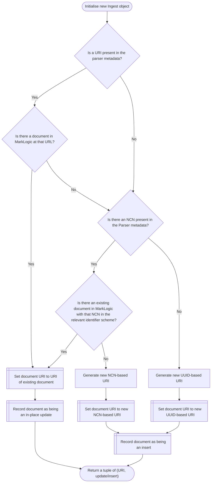

# URI resolution/generation logic

This flowchart explains the logic followed by the ingester to find the correct URI and insert/update path for a document.

This process is called as part of the `__init__()` method on `Ingest` objects

