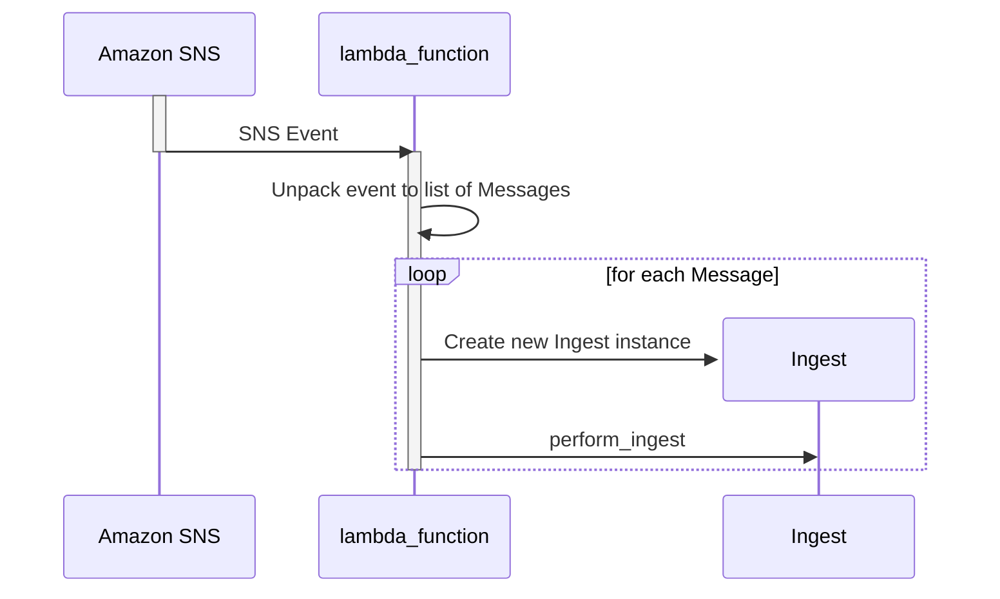

# Ingestion workflow

This describes the sequence of events which happens when a document is ingested.

```mermaid

sequenceDiagram
    participant SNS as Amazon SNS
    participant lambda as lambda_function


    activate SNS
    SNS ->> lambda : SNS Event
    deactivate SNS

    activate lambda

    lambda ->> lambda : Unpack event to list of Messages

    loop for each Message

        create participant Ingest

        lambda ->> Ingest : Create new Ingest instance
        lambda ->> Ingest : perform_ingest

        activate Ingest

        destroy Ingest


    end

    deactivate lambda

```
