# Ingestion workflow

This describes the sequence of events which happens when a document is ingested, getting the bundled XML, metadata and artefacts from S3 (following parsing) and loading them into MarkLogic and the unpublished documents bucket.

```mermaid

sequenceDiagram
    participant SNS as Amazon SNS
    participant lambda as lambda_function
    participant perform_ingest

    activate SNS
    SNS ->> lambda : SNS Event
    deactivate SNS

    activate lambda

    lambda ->> lambda : Unpack event to list of Messages

    loop for each Message

        create participant Ingest
        lambda ->> Ingest : Create new Ingest instance
        note right of Ingest: __init__() on Ingest does the work of downloading and<br>establishing facts about the incoming document.
        activate Ingest

        Ingest ->> Ingest : Assign internal variables based on message contents

        participant S3_TRE as S3<br>(TRE bucket)

        Ingest <<->> S3_TRE : Download consignment .tar.gz
        Ingest ->> Ingest : Unpack .tar.gz to local filesystem
        Ingest ->> Ingest : Extract metadata from JSON blob
        Ingest ->> Ingest : Get document XML
        Ingest ->> Ingest : Determine document URI and presence of existing document
        Ingest ->> lambda : Return Ingest object

        deactivate Ingest

        lambda ->>+ perform_ingest : perform_ingest(Ingest)
        note right of perform_ingest: This is where we actually start to insert or update things.<br>perform_ingest() orchestrates the operations.

        perform_ingest ->>+ Ingest: insert_or_update_xml()
        note right of Ingest: insert_or_update does the work of getting the XML into MarkLogic
        Ingest ->>+ Ingest: existing_document_uri()
            Ingest <<->> MarkLogic: Get existing documents with the same identifier value
            alt If there is exactly one matching document in the same identifier scheme
                Ingest ->> Ingest: Return existing document URI
            else
                break There are multiple matching documents
                    Ingest ->> Ingest: Raise MultipleResolutionsFoundError exception
                end
            else
                Ingest ->> Ingest: Return no existing documents
            end
            deactivate Ingest
        alt If existing document in MarkLogic
            Ingest ->>+ Ingest: update_document_xml()
                Ingest ->> Ingest: Build annotation object
                Ingest <<->> MarkLogic: Get existing document from MarkLogic
                break Get operation fails
                    Ingest ->> Ingest: Return False
                end
                Ingest ->> MarkLogic: Update document body in MarkLogic
            deactivate Ingest
            break Update operation returns False
                Ingest ->> Ingest: Raise DocumentInsertionError exception
            end
        else
            Ingest ->>+ Ingest: insert_document_xml()
                Ingest ->> Ingest: Build annotation object
                Ingest ->> MarkLogic: Insert new document body in MarkLogic
            deactivate Ingest
            break Insert operation fails
                Ingest ->> Ingest: Raise DocumentInsertionError exception
            end
        end
        deactivate Ingest

        perform_ingest ->>+ Ingest: set_document_identifiers()
        note right of Ingest: Make sure the document has the right identifiers as structured data
        opt The document has an NCN
            Ingest ->> Ingest: Build new identifier object
            Ingest ->> Ingest: Save identifier to document instance
            Ingest ->>+ Ingest: document.save_identifiers()
                Ingest ->> MarkLogic: Save identifiers to document properties in MarkLogic
            deactivate Ingest
        end
        deactivate Ingest

        perform_ingest ->>+ Ingest: send_email()
        note right of Ingest: Send the new/updated document emails
        alt If originator is "FCL":
            note right of Ingest: Reparse, no email to be sent
        else if originator is "FCL S3"
            note right of Ingest: Bulk upload
            alt Document set to force publish?
                note right of Ingest: No email to be sent
            else
                Ingest ->>+ Ingest: send_updated_judgment_notification()
                    Ingest ->> GOV.UK Notify: Send email
                deactivate Ingest
            end
        else if originator is "TDR"
            note right of Ingest: Standard upload via TDR
            alt Document newly inserted?
                Ingest ->>+ Ingest: send_new_judgment_notification()
                    Ingest ->> GOV.UK Notify: Send email
                deactivate Ingest
            else
                Ingest ->>+ Ingest: send_updated_judgment_notification()
                    Ingest ->> GOV.UK Notify: Send email
                deactivate Ingest
            end
        else
            break Originator is unrecognised
                Ingest ->> Ingest: Raise RuntimeError exception
            end
        end
        deactivate Ingest

        opt If TDR parameters present
            perform_ingest ->>+ Ingest: store_metadata()
            note right of Ingest: Sets the TDR-based document properties (eg uploader details) in MarkLogic
            Ingest ->> MarkLogic : Set document metadata properties
            deactivate Ingest
        end

        participant S3_unpublished as S3<br>(unpublished bucket)

        perform_ingest ->>+ Ingest: save_files_to_s3()
        note right of Ingest: Put the artefacts into the unpublished documents S3 bucket
        Ingest ->> Ingest: Determine if .docx file in TRE metadata
        opt If no .docx in TRE metadata
            Ingest ->> Ingest: Append _nodocx to local .tar.gz filename
        end
        Ingest <<->> S3_TRE: Download consignment .tar.gx and save locally
        opt If .docx in TRE metadata
            Ingest ->> Ingest: Unpack .tar.gz to local filesystem
            Ingest ->> S3_unpublished: Upload .docx to S3
        end
        Ingest ->> S3_unpublished: Upload parser log file to unpublished documents bucket
        loop For each image in TRE payload metadata
            Ingest ->> S3_unpublished: Upload image to S3
        end
        deactivate Ingest

        participant S3_published as S3<br>(published bucket)

        alt Document is set to auto-publish
            perform_ingest ->>+ Ingest: document.publish()
            perform_ingest ->> Ingest: update_published_documents()
            Ingest <<->> S3_unpublished : Get list of assets with document prefix
            loop For each asset
                Ingest ->> S3_published : Copy asset to published bucket
            end
            deactivate Ingest
        else Document is not set to auto-publish
            perform_ingest ->>+ Ingest: document.unpublish()
            deactivate Ingest
        end

        deactivate perform_ingest

    end

    deactivate lambda

```

